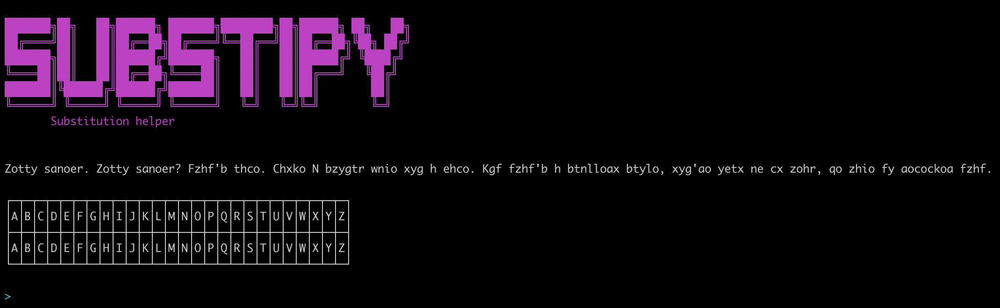
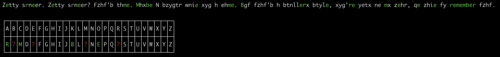

# SubstiPy
Substitution helper


*I made this script years ago, I improved it a little bit before pushing it, I hope it will help some people for CTFs. Do not hesitate to propose new features.*


Launch the program as shown below :

```python3 SubstiPy.py <text_file> <wordlist>```



```> help```


```> frequency```


*Here, in english, the letter O is clearly the letter E*

So you can replace this letter ```> replace o e```


You can also look for a specific ciphered word in a wordlist
(```find Fzhf'b T__t's``` if you already know clear letters, output: "that's")


and swap this whole word

```> swap aocockoa remember```


